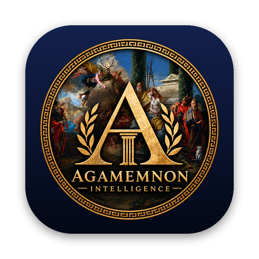

<p align="center">
  
</p>

<h1 align="center">Agamemnon</h1>

<p align="center">Free, open-source antivirus for macOS.</p>

<p align="center">
  <a href="LICENSE"></a>
  
  
  <a href="https://github.com/Agamemnon-Intelligence/Agamemnon-windows"></a>
</p>

## What it does

- **Encrypted DNS.** Choose Cloudflare, Quad9, Mullvad or AdGuard and turn on DNS-over-HTTPS for the whole Mac. The malware-blocking options also stop known malware and phishing sites.
- **Malware scanning.** Quick, Full, Custom (drag and drop) and scheduled scans. Threats go into a quarantine vault, where you can restore them or delete them for good.
- **Archive and installer scanning.** Looks inside ZIP, RAR, 7Z, TAR, ISO, XAR, DMG and PKG files, up to 3 levels deep, so threats can't hide inside. There are limits to protect against zip bombs.
- **Download protection.** New files in Downloads (and any other folders you add) are checked as soon as the download finishes. Dangerous files are quarantined, and apps Apple hasn't notarized are flagged.
- **Administrator access alerts.** Warns you when an app asks for your admin password.
- **Background item alerts.** Warns you when something installs a LaunchAgent or LaunchDaemon so it starts automatically, then scans it.
- **Menu bar status icon**, dark midnight theme, and a Credits page.

A Windows version is in development. See [Agamemnon for Windows](#agamemnon-for-windows).

## How detection works

For the full details (scans, quarantine, real-time protection, DNS, privacy and limits), see **[HOW_IT_WORKS.md](HOW_IT_WORKS.md)**.

| Engine | What it checks |
| --- | --- |
| Agamemnon | SHA-256 of every file against the [MalwareBazaar](https://bazaar.abuse.ch) list of more than 1 million known-malware hashes (downloaded on first launch and updated twice a day), plus the EICAR test file. |
| Gatekeeper | Asks macOS whether downloaded apps and installers are signed and notarized. Revoked developer certificates count as malware. |
| ClamAV *(optional)* | If you `brew install clamav`, Agamemnon keeps its own ClamAV signatures up to date and runs `clamscan` as a second opinion. |

Archives are opened with tools that ship with macOS (`bsdtar`, `hdiutil`, `pkgutil`), in a private temporary folder. Disk images are mounted read-only and hidden from Finder.

## Install

Download `Agamemnon.dmg` from [Releases](../../releases), open it and drag Agamemnon to Applications.

Builds without a Developer ID signature are ad-hoc signed. The first time you open one, macOS blocks it. Go to **System Settings › Privacy & Security** and click **Open Anyway**.

For full scans, give Agamemnon **Full Disk Access** in System Settings › Privacy & Security.

## Build

The Xcode project is generated with [XcodeGen](https://github.com/yonaskolb/XcodeGen):

```sh
brew install xcodegen
xcodegen generate
open Agamemnon.xcodeproj
```

GitHub Actions builds a universal app and DMG on every push (`.github/workflows/build.yml`) and publishes it as the **Nightly build** release. To ship a signed and notarized DMG, add these repository secrets:

- `DEVELOPER_ID_P12`: your Developer ID Application certificate, as a base64-encoded .p12
- `DEVELOPER_ID_P12_PASSWORD`: the password for that .p12
- `APPLE_ID`, `APPLE_TEAM_ID` and `APPLE_APP_PASSWORD`: for notarization

## Limits

- Download protection reacts within about 2 seconds of a download finishing. Blocking a file *before* any app can open it needs Apple's Endpoint Security entitlement, which this build doesn't have.
- Encrypted DNS uses a configuration profile, so macOS asks you to approve it in System Settings.
- Admin access alerts read the system log, which needs an administrator account.
- No antivirus catches everything. Keep macOS updated and only install software you trust.

## Agamemnon for Windows

The Windows build lives in its own repository: **[Agamemnon-Intelligence/Agamemnon-windows](https://github.com/Agamemnon-Intelligence/Agamemnon-windows)**.

It's still in development. Downloads, build instructions and issues for the Windows version are in that repository.

## Credits

Created by [mirazbakis](https://github.com/mirazbakis) and [mertyesileducation](https://github.com/mertyesileducation).

Malware hashes come from MalwareBazaar by abuse.ch. The optional second engine is ClamAV by Cisco Talos. The emblem is built around *The Sacrifice of Iphigenia* by Giovanni Battista Tiepolo, which is in the public domain.

## License

Agamemnon is free software, released under the [GNU General Public License v2.0](LICENSE).

Copyright (C) 2026 mirazbakis and mertyesileducation
